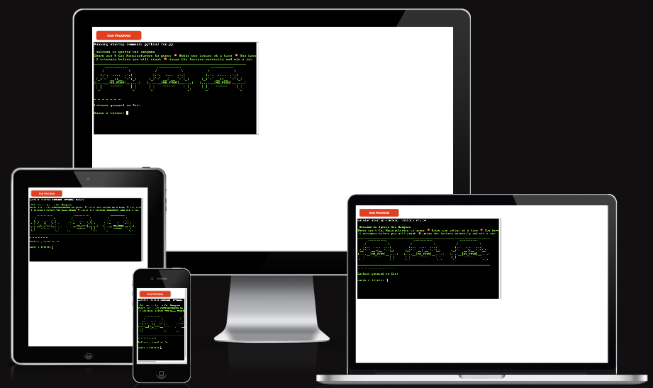

# HANGMAN  SPORTS CAR EDITION

The live link can be found here - https://carman.herokuapp.com/

Welcome to the Hangman Sports Car Edition, this is a variation on the clasic hang man game.

instead of your man becoming closer to a good old hanging like in the classic game, you will spell out the word crash if you cant guess the name of the sports car, resulting in absolute mayhem!!

## How to use:

- The user will guess a letter to find out what car manufacturer is being hidden.

- If the user enters incorrect letter part of the word crash will appear, the game is over once you guess the word or see the word crash appear.

#### Features:

- When you run the programme you are greeted by the following welcome screen:

- You are then prompted to choose a letter & shown the amount of letters to guess

- After you input the correct data you will see the hidden word appear.

- If you enter the  incorrect letter you will see a letter from the word CRASH appear.

- After 5 wrong attempts the whole word CRASH will appear, and the game is over.

- If you guess the word a winner messages will appear saying you have won the car that you have guessed the name of.

#### User Goals and objectives:

The main goals and objectives of this programme are as follows

- To give the user a fun game to play.
- To provide a light challenge.
- To be simple to use with easy to follow instructions.
- The programme will provide a final message saying you have lost or won.

#### Deployment:

To Deploy this project i used Heroku, the steps i used are as follows:

1.  Before deployment i installed the list of dependencies using the command pip3 freeze > requirements.txt
2. i then logged into my Heroku account and select new > create app 
3. then i name my app and select country/region
4. Settings > config vars, and in the "key" section i enter CREDS and in the "value" section i add the copy & pasted info from my CREDS.JSON file > add
5. Settings > build packs > add build pack > python > save changes > add build pack > nodes > save changes 
6. then ass the deployment feature was not working on Heroku i had to do it through my github terminal as follows:
7. To login enter: Heroku login -i, and enter your Heroku login details>
8. then enter: Heroku apps
9. then enter: Heroku git:remote -a 
10. and finally enter: git add., git commit -m ""Deploy to Heroku via CLI" & git push both git push: origin main & git push: Heroku main 

#### Testing:

- I ran the code through the https://pep8online.com/

- After reviewing the results i fixed all the errors with the results shown below

#### Manual Testing:

- I have enterered too many letters, and get this message.

- Ihave entered the same letter, and get this mesdsage

#### Phase 2:

- There are some additional features that could be added at a later stage to create a more detailed and complete picture for the user some of these are noted below

1. 

#### Technologies Used: 

- [Github](https://github.com/) was used to create the repository and to store the project's code after pushed from Git.

- [Gitpod](https://www.gitpod.io/) was used as the Code Editor for the site.

- [Pep8](https://pep8online.com/) - this was used to fix any errors found (mainly spacing issues).

- [Heroku](https://heroku.com/) - this was used to deploy the programme.

- [Ascii](https://ascii.co.uk/) - this was used for some textual display.

- [SpellCheck](https://online-spellcheck.com/) this was used to check spelling and grammar of the readme file.

- [Ami](https://ui.dev/amiresponsive) - this was used to create the screenshot image at the top of the readme file.

#### Credits:

- 

- Marcel - My mentor Marcel was extreamly helpful as always helping me feel confident in what I have made.